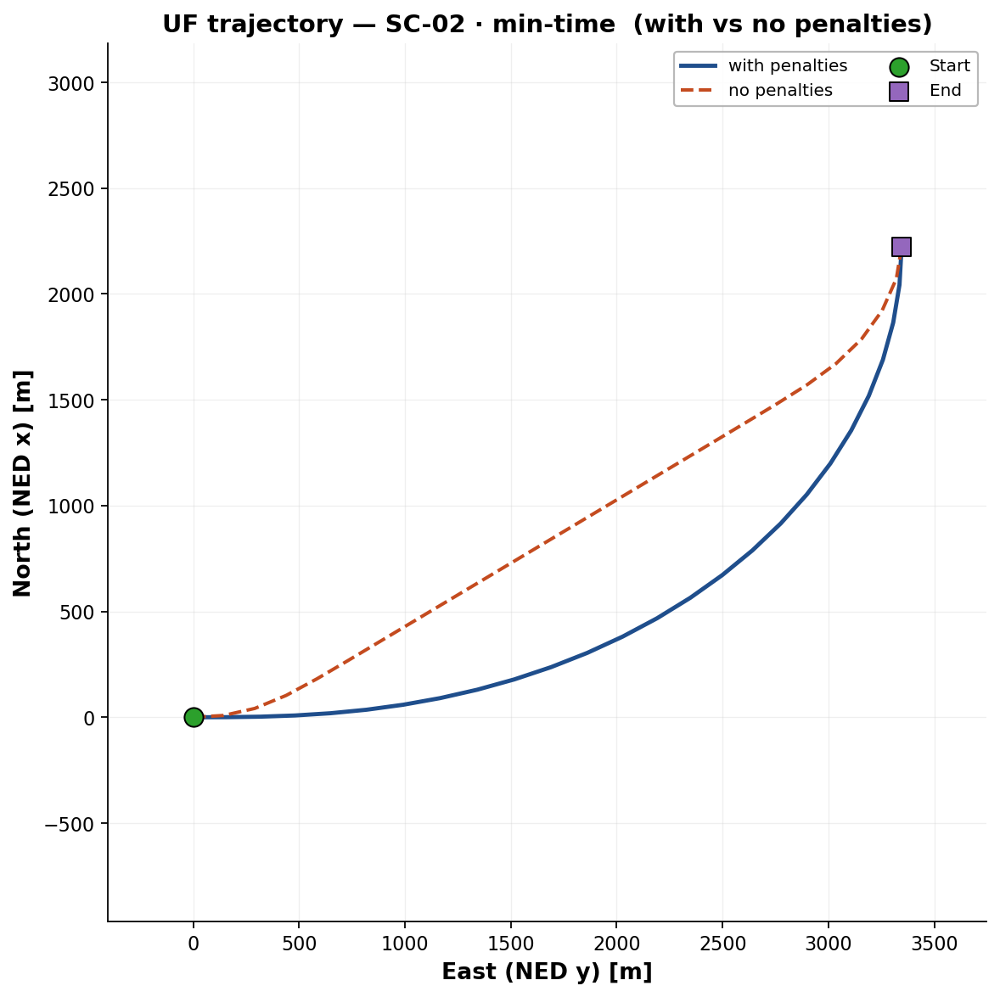
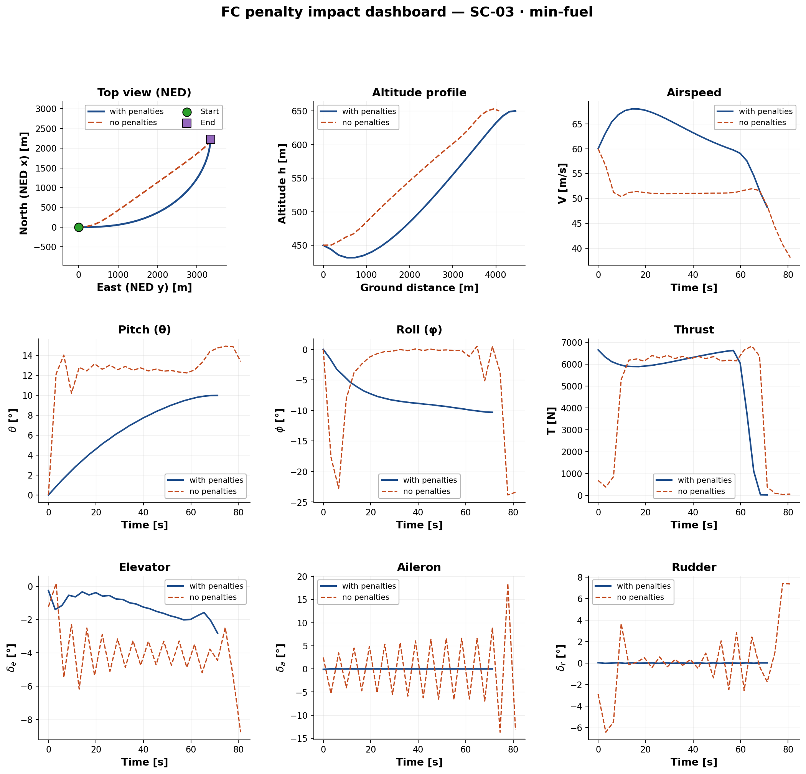

# 12. Validation results

!!! abstract "TL;DR"
    Four reference scenarios in empty airspace isolate longitudinal and lateral behaviour. Every converged solution is checked *a posteriori* for dynamic consistency, constraint margins, UF–FC agreement and time–fuel behaviour.

## Scenarios

A $2\times2$ factorial design (straight vs. 180° turn; level vs. +200 m climb), no wind, with DEM, NFZ, geofence and waypoints deactivated so that only the physics is tested.

| ID | Geometry | ΔAlt [m] | Distance [km] |
|---|---|---|---|
| SC-00 | Straight, level | 0 | 3.35 |
| SC-01 | Straight, climb | +200 | 3.36 |
| SC-02 | 180° turn, level | 0 | 4.09 |
| SC-03 | Climb + 180° turn | +200 | 4.10 |

Each is solved with UF and FC, for minimum time ($\alpha=0$) and minimum fuel ($\alpha=1$).

## Acceptance metrics

| Metric | Criterion |
|---|---|
| Maximum normalised defect | $\lVert\Delta\rVert_\infty\le10^{-4}$, computed from the converged vector, outside the solver |
| Constraint margins | every inequality satisfies $h_j(z)\le0$ at every node |
| UF–FC consistency | trajectories within a spatial tolerance scaled by reference length and node count |
| Min-time vs. min-fuel | qualitatively expected signatures (see below) |
| Regularisation impact | see [page 13](13-results-penalties.md) |

## What the two objectives look like

- **Minimum time**: the solution saturates the propulsive envelope (maximum thrust, high speed, turns at the load-factor limit).
- **Minimum fuel**: speed settles near the best-$L/D$ condition with gentle climb and cruise.

<figure markdown>
  { width="60%" }
  <figcaption>Point-mass (UF) result for the level 180° turn (SC-02), minimum time.</figcaption>
</figure>

<figure markdown>
  { width="95%" }
  <figcaption>Rigid-body (FC) dashboard for the combined climb-and-turn (SC-03), minimum fuel.</figcaption>
</figure>

!!! info "Scope of this page"
    Per-scenario margin tables and the 200+ dashboards are in the thesis PDF and its annexes.

[← Previous](11-warm-start.md) · [Next: Regularisation →](13-results-penalties.md)
