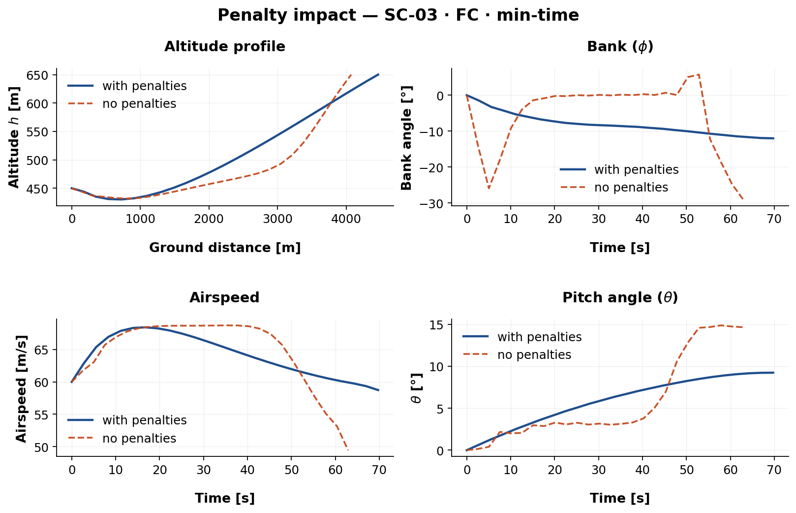
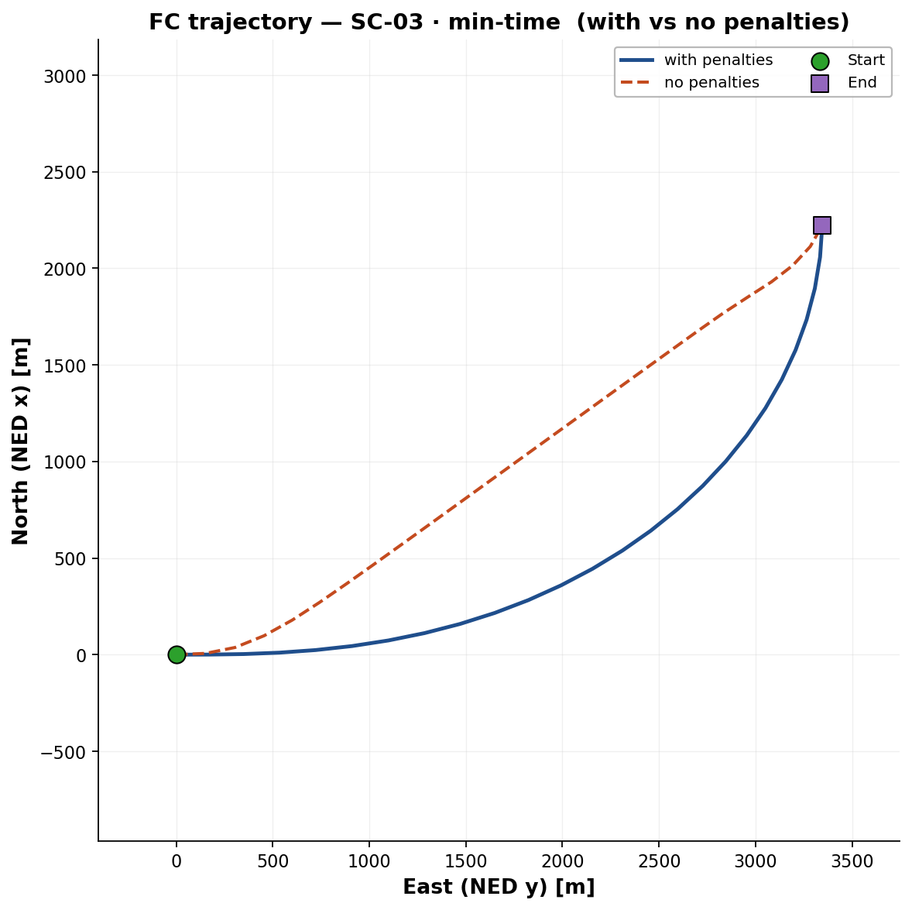

# 13. Effect of the smoothness regularisation

!!! abstract "TL;DR"
    The penalties remove control chatter and make trajectories flyable, but they are **not free**: for the 6-DoF model they shift the optimum noticeably.

## Experiment

Each scenario was solved twice, with the production gates $\beta_c=\beta_s=1$ and with the ablation $\beta_c=\beta_s=0$, keeping the warm start and IPOPT settings identical.

<figure markdown>
  { width="90%" }
  <figcaption>FC, SC-03, minimum time. Without penalties (dashed) bank and pitch jump abruptly; with penalties (solid) they evolve smoothly.</figcaption>
</figure>

<figure markdown>
  { width="50%" }
  <figcaption>Ground track of the same case. The two runs reach the same goal along visibly different paths.</figcaption>
</figure>

## Headline numbers (SC-01, minimum fuel)

| Model | Metric | With reg. | No reg. | Δ [%] |
|---|---|---:|---:|---:|
| UF | Flight time [s] | 66.15 | 66.66 | +0.77 |
| UF | Energy [J] | 1.72e7 | 1.70e7 | −1.16 |
| UF | Mean thrust [N] | 4964 | 4844 | −2.43 |
| FC | Flight time [s] | 54.81 | 66.50 | +21.3 |
| FC | Energy [J] | 1.98e7 | 1.71e7 | −13.6 |
| FC | Mean thrust [N] | 5712 | 4819 | −15.6 |

(Δ is as reported in the thesis table.)

## Reading the results honestly

- **UF** is barely affected: a few percent at most.
- **FC** shows a much larger change in flight time and energy. The unregularised solver converges to a *different time horizon* with nearly the same path length (3355.8 m vs 3355.5 m). Getting a smooth optimum is harder with the full rigid-body model and often leaves it more suboptimal.
- Total variation of the controls drops sharply on every axis, and collocation defects stay below tolerance in both cases. The unregularised runs are not "wrong" in the mathematical sense; they are just not flyable.
- Most of the penalty mass sits on $w_{\Delta\delta_e}$ and $w_{\Delta T}$ in FC, and on $w_{\Delta C_L}$ in UF: exactly the channels that oscillate most without regularisation.

[← Previous](12-results-validation.md) · [Next: Warm-start benchmark →](14-results-warmstart.md)
