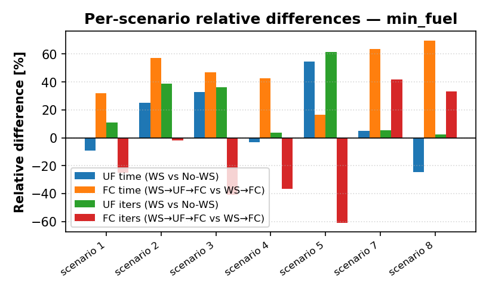
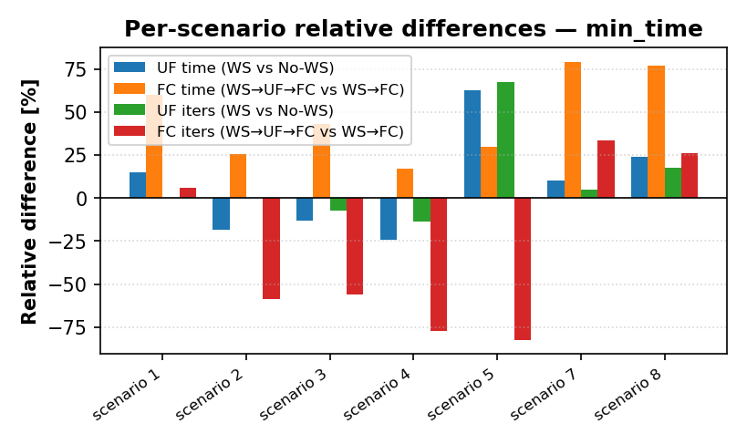
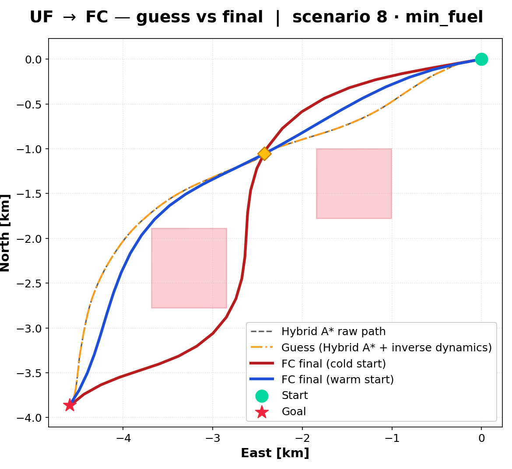
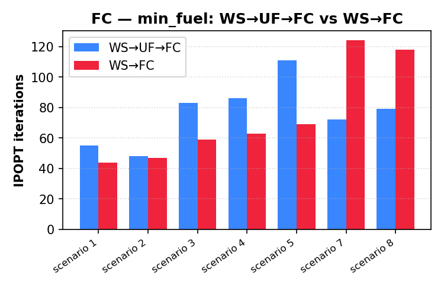

# 14. Warm-start benchmark

!!! abstract "TL;DR"
    Cold start fails the point-mass solver in every NFZ/waypoint-only scenario. The full pipeline converges 8/8, and the 6-DoF stage runs 1.2–4.4× faster than a direct seed, with the largest gain in the hardest scenario. The 6-DoF stage still misses the 4 s real-time target.

## Setup

Eight scenarios × two objectives (min-fuel, min-time), two repetitions (times are means; iterations come from the fastest repetition).

| Scenario | Family |
|---|---|
| 1–4 | empty airspace |
| 5–6 | NFZ only |
| 7 | waypoints only |
| 8 | NFZ + waypoints |

Two independent comparisons:

- **UF — value of the warm start.** Hybrid A\* + inverse dynamics (WS) against a linear-interpolation guess (No-WS).
- **FC — value of the intermediate UF stage.** `WS→UF→FC` (full chain) against `WS→FC` (seed FC directly from inverse dynamics).

A run counts as feasible only if the **final** stage returns `Solve_Succeeded` / `Solved_To_Acceptable_Level`, produces a trajectory, and stays within the wall-clock budget (40 s).

## UF: robustness, not always speed

| | min-fuel | min-time |
|---|---|---|
| No-WS UF converges | 5/8 | 5/8 |
| WS UF converges | **8/8** | **8/8** |
| Failing No-WS cases | scenarios 5, 6, 7 (restoration failed / infeasible) | same |
| WS faster than No-WS (converged pairs) | 3/5 | 1/5 |

WS UF times are 0.5–3.0 s, within the 4 s target. In easy empty-airspace cases the warm start can be slightly *slower* in total, because the Hybrid A\* and inverse-dynamics time (40–220 ms and 2–25 ms) is added; the benefit shows where the cold start struggles: it fails outright in scenarios 5–7.

## FC: the intermediate UF stage pays off

| Scenario | min-fuel `WS→FC` | min-fuel `WS→UF→FC` | min-time `WS→FC` | min-time `WS→UF→FC` |
|---|---:|---:|---:|---:|
| 1 | 11.2 s | 6.7 s | 12.1 s | 4.5 s |
| 2 | 12.1 s | 5.2 s | 8.2 s | 5.2 s |
| 3 | 21.3 s | 11.3 s | 12.9 s | 8.5 s |
| 4 | 17.1 s | 12.2 s | 14.0 s | 10.3 s |
| 5 | 20.6 s | 12.8 s | 12.4 s | 10.5 s |
| 6 | 21.0 s | 9.4 s | 22.7 s | 12.9 s |
| 7 | **timeout (>60 s)** | 11.9 s | **timeout (>60 s)** | 11.6 s |
| 8 | 48.8 s | 11.1 s | 41.4 s | 10.8 s |

- Faster in **7/7** scenarios where both converge; mean saving 11.9 s (min-fuel) and 8.7 s (min-time).
- Scenario 8 (NFZ + waypoints): **4.4×** (min-fuel) and **3.8×** (min-time); 111–118 iterations for the direct seed against 79–82 with the full chain.
- Scenario 7: only the full chain converges.
- The two pipelines end at nearly the same solution: trajectory deviation 3.3–4.5 %, end mass differences ≤ 0.1 kg.

<figure markdown>
  { width="48%" }
  { width="48%" }
  <figcaption>FC speed-up of the full pipeline over a direct seed, per scenario.</figcaption>
</figure>

<figure markdown>
  { width="65%" }
  <figcaption>Scenario 8, minimum fuel: Hybrid A* path, warm-start guess, and the final FC trajectories from a cold start and from the warm start, around two no-fly zones and one waypoint (diamond).</figcaption>
</figure>

<figure markdown>
  { width="65%" }
  <figcaption>IPOPT iterations in the FC stage.</figcaption>
</figure>

## Limitations visible in the data

- **FC does not meet 4 s.** Total FC pipeline time with warm start is 4.5–12.9 s on this hardware; only UF (0.5–3.0 s) meets the target.
- The full chain does not always use fewer iterations: in some scenarios `WS→FC` needs fewer IPOPT iterations but each is far more expensive, so wall-clock still favours the full chain.
- Without warm start, scenario 5–7 UF trajectories also deviate 50–100 % from the warm-start ones, i.e. the cold solver was not finding the same optimum.
- Only 8 scenarios, 2 repetitions each, one machine. These results show the mechanism, not a statistical guarantee.

Raw aggregated table: [`results/benchmark_summary.csv`](https://github.com/pablourioste/uav-optimal-trajectory-planning/blob/main/results/benchmark_summary.csv).

[← Previous](13-results-penalties.md) · [Next: Conclusions →](15-conclusions.md)
