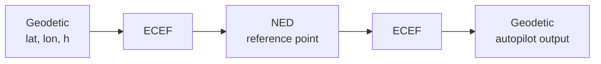

# Appendix: coordinate frames

!!! abstract "TL;DR"
    Missions arrive as geodetic coordinates (WGS-84); the optimiser works in a local NED frame; output goes back to geodetic for the autopilot.

## Frames

- **Geodetic**: latitude $\varphi$, longitude $\lambda$, ellipsoidal height $h$ on the WGS-84 ellipsoid.
- **ECEF**: Earth-centred Earth-fixed Cartesian $(X,Y,Z)$.
- **NED**: local North–East–Down at a reference point; altitude is $-z$.

## Chain

Geodetic to ECEF, with $N(\varphi)=a/\sqrt{1-e^2\sin^2\varphi}$:

$$
\begin{aligned}
X&=(N+h)\cos\varphi\cos\lambda,\\
Y&=(N+h)\cos\varphi\sin\lambda,\\
Z&=\big(N(1-e^2)+h\big)\sin\varphi .
\end{aligned}
$$

ECEF displacement from the reference point is rotated into NED with the local rotation built from $\varphi_0,\lambda_0$. For long horizontal legs an altitude curvature correction compensates for the flat-earth assumption of the local frame.

Details: thesis, Annex 4.

[Back to home](index.md)
