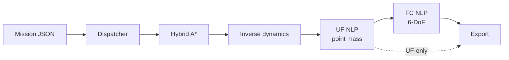

# Optimal 3D Trajectory Planning for a Fixed-Wing UAV

Documentation of a Bachelor's thesis (UPC – ESEIAAT) carried out with **CIMNE** and in collaboration with **Singular Aircraft**: a 3D trajectory optimiser for the amphibious heavy UAV **Flyox I**, built on trapezoidal direct collocation and IPOPT, and accelerated by a Hybrid A\* warm-start chain.

!!! note "About the code"
    The production solver is proprietary to Singular Aircraft and is not published. These pages document the **method**: equations, diagrams, pseudocode and results.

## How to read this documentation

| If you want… | Start at |
|---|---|
| The one-minute version | [README](https://github.com/pablourioste/trajectory_opt_uav#readme) |
| What was asked and why it is hard | [1. Problem and requirements](01-problem.md) |
| The numbers | [14. Warm-start benchmark](14-results-warmstart.md) |
| How the solver is built | [5. OCP and NLP](05-ocp-theory.md) → [11. Warm start](11-warm-start.md) |
| What does *not* work yet | [15. Conclusions](15-conclusions.md) |

## The idea in one picture

A cheap geometric search provides a path; inverse dynamics turns it into a dynamically plausible guess; a fast point-mass optimisation refines it; a projection seeds the full 6-DoF optimisation. Each step hands the next one a better starting point, which is what makes the interior-point solver converge reliably.

## Full thesis

The complete thesis is available as a PDF in the repository: `thesis/Optimal_3D_Trajectory_Planning_Thesis_Urioste.pdf`.

[Next: Problem and requirements →](01-problem.md)
